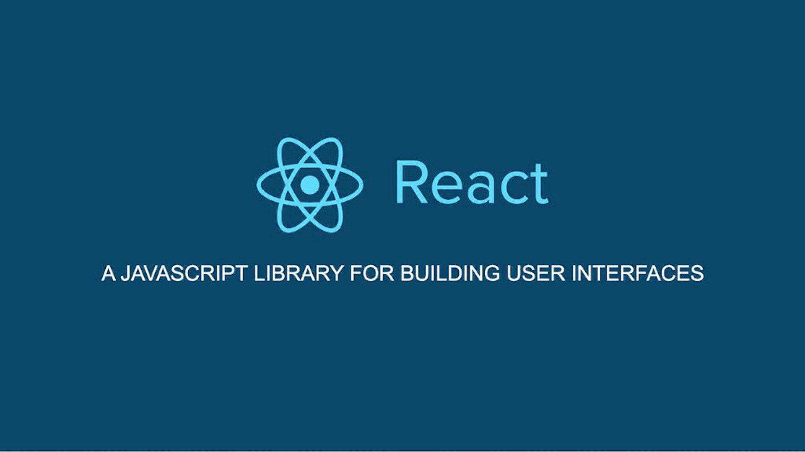

# 课程介绍

一个用于构建用户界面的 <u>JavaScript</u> 库

## 起源

`React` 起源于 `Facebook` 的内部项目，因为该公司对市场上所有 JavaScript MVC 框架，都不满意，就决定自己写一套，做出来以后，发现这套东西很好用，就在2013年5月开源了，随后越来越多人开始关注和使用 `React`，慢慢的 `React` 就成为了当前最流行的前端开发框架之一

## 特点

- `React` 采用了声明式编程范式，可以更加方便的构建 `UI` 应用
- 内部封装更加高效的与底层`DOM`进行交互的逻辑，提高性能的同时也能帮助我们更加专注于业务
- 可以很好的接纳其它框架或库与其进行配合

## React 全家桶

- `React` : 提供框架（库）核心功能，如 `组件`、`虚拟DOM` 等
- `create-react-app` : 脚手架，提供一套用于快速 构建和打包 `React` 项目的工具
- `react-router` : 基于 `React` 的路由库
- `redux、react-redux` : 状态管理库