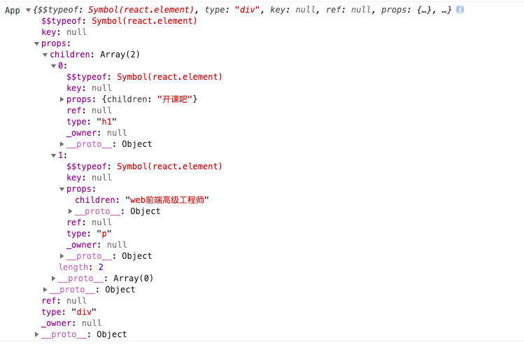

# 初识 React 与 JSX

[TOC]

## 加载引入

- 基于浏览器 \<script\> 的模式
- 基于自动化的集成环境模式


## 基于浏览器 \<script\> 的模式

React.js 框架本身包含两个部分

- react.js：提供 React.js 核心功能代码，如：虚拟 dom，组件
- react-dom.js：提供了与浏览器交互的 DOM 功能，如：dom 渲染

```html
<!DOCTYPE html>
<html lang="en">
<head>
    <meta charset="UTF-8">
    <meta name="viewport" content="width=device-width, initial-scale=1.0">
    <meta http-equiv="X-UA-Compatible" content="ie=edge">
    <title>Document</title>
</head>
<body>

    <div id="app"></div>
    
    <script src="./js/react.production.min.js"></script>
    <script src="./js/react-dom.production.min.js"></script>
    <script src="js/app.js"></script>
</body>
</html>
```

<u>js/app.js</u>

```js
ReactDOM.render(
    '<div>开课吧</div>',
    document.getElementById('app')
);
```

**ReactDOM.render**

```js
ReactDOM.render(element, container[, callback])
```

element：要渲染的内容

container：要渲染的内容存放容器

callback：渲染后的回调函数

**XSS**

为了有效的防止 `XSS` 注入攻击，`React DOM` 会在渲染的时候把内容（字符串）进行转义，所以字符串形式的标签是不会作为 `HTML` 标签进行处理的


## 编程范式

就是编程的一种模式，比较流行的一些编程范式

- 命令式编程
- 声明式编程
- 函数式编程
- ......

### 命令式编程

告诉计算机怎么做（<u>How？</u>） - 过程

在前面的原生 <u>WebComponent</u> 中，我们 <u>UI</u> 的构建是使用了命令式的编程方式来完成的

```js
let shadow = this.attachShadow({mode: 'open'});

let style = document.createElement('style');
style.textContent = `span {color:red}`;

let span = document.createElement('span');
span.innerHTML = '我是自定义元素的内容';
span.classList.add('cred');

shadow.appendChild(style);
shadow.appendChild(span);
```

### 声明式编程

告诉计算机我们要什么（<u>What？</u>） - 结果

```sql
SELECT * FROM `USER` WHERE `gender`='男' ORDER BY `age` DESC;
```

上面的 <u>SQL</u> 就是一个典型的声明式编程，告诉数据库，我要什么结果，至于怎么查询出来结果，排序如何实现的过程 <u>SQL</u>  并不关心，由内部（底层）实现

```js
['k',1,2,'k',true,'b'].filter(v => Number.isFinite(v)).map(v=>v*10).reduce((c, v)=>c + v, 0);
```

### React.js 中的声明式 UI

```jsx
<span className="cred">我是自定义元素的内容</span>
```


## 使用 <u>JSX</u>

`JSX` 是一个基于 `JavaScript` + `XML` 的一个扩展语法

- 它可以作为 `值` 使用
- 它并不是 `字符串`
- 它也不是 `HTML`
- 它可以配合 `JavaScript 表达式` 一起使用

<u>js/app.js</u>

```jsx
ReactDOM.render(
    <div>开课吧</div>,
    document.getElementById('app')
);
```

### 引入 <u>JSX</u> 解析库

babel-standalone.js：在浏览器中处理 `JSX`

```html
<script src="https://cdn.bootcss.com/babel-standalone/6.26.0/babel.min.js"></script>
<script type="text/babel" src="js/app.js"></script>
```

> 注意：如果包含或引入的代码中包含 `JSX` ，需要设置 `script` 标签的 `type` 属性为：`text/babel`


## <u>DOM</u> 对象与 <u>Virtual DOM</u>

#### DOM 对象

浏览器会把页面中的元素映射为 JavaScript 中的对象，在 JavaScript 中通过对这些对象的访问来获取页面中对应元素及其内容。同时，对这些对象进行某些操作，又会反馈到页面中对应的元素上面。

但是，原生 JavaScript DOM 对象内容和结构太复杂，有很多的特性是我们平时很少用到的，而且我们对对象的操作会立即反馈到页面（渲染），影响性能

#### 虚拟 DOM

virtual DOM，参考原生 DOM 对象构建的一个对象，它的结构足够简单，同时优化渲染逻辑，减少变化带来的渲染性能影响

```jsx
const App = (
    <div>
        <h1>开课吧</h1>
        <p>web前端高级工程师</p>
    </div>
);
```

生成的 virtual DOM 结构如下：




## <u>JSX</u> 语法规则

### 结构

每一个独立 `JSX` 结构的顶层有且只能有一个顶级父元素

```jsx
// 错误
const App = (
	<div>
  	<h1>开课吧</h1>
    <p>web前端高级工程师</p>
  </div>
  <div>第二个</div>
);

// 正确
const App = (
	<div>
    <div>
      <h1>开课吧</h1>
      <p>web前端高级工程师</p>
    </div>
    <div>第二个</div>
  </div>
);
```

### 在 <u>JSX</u> 中嵌入表达式

在 `JXS` 中可以使用 <u>{表达式}</u> 嵌入`JavaScript`表达式

**表达式**：产生值的一组代码的集合

- 变量
- 算术运算
- 函数调用
- ……

```jsx
let name = '开课吧';
let title = 'web前端高级工程师';
const App = (
    <div>
        <h1>{name}</h1>
        <p>{title}</p>
    </div>
);
```

> <span style="color:red">注意：分清楚 <u>表达式</u> 与 <u>语句</u> 的区别，<u>if</u>、<u>for</u>、<u>while</u> 这些都是语句，<u>JSX</u> 不支持语句</span>
>
> ```jsx
> <h1>{if (true) {...}</h1>	// 错误
> ```


## <u>JSX</u> 语法示例

在 `JSX` 中，表达式输出的内容类型与使用位置也有一些区别

### <u>JSX</u> 中的注释

```jsx
<div>
  	{/*注释*/}
  	{/*
  			多行注释
  	*/}
</div>
```

### 输出数据类型

- <u>字符串</u>、<u>数字</u>：原样输出
- <u>数组</u>：转成字符串，数组.join('')
  - 使用 <u>空字符串</u> 而不是默认的 <u>逗号</u> 连接
- <u>其它对象</u>不能直接输出
- <u>布尔值</u>、<u>空</u>、<u>未定义</u> 会被忽略

### 在属性上使用 <u>表达式</u>

<u>JSX</u> 中的表达式也可以使用在属性上，但是使用的时候需要注意

- 当在属性中使用 <u>{}</u> 的时候，不要使用引号包含

```jsx
let id = 'kaikeba';

// 错误
const App = (
    <div id="{id}"></div>
);

// 正确
const App = (
    <div id={id}></div>
);
```

- <u>JSX</u> 更偏向 <u>JavaScript</u>， 所以对于一些特殊的属性，使用的是 <u>JavaScript</u> 中的属性名风格

```jsx
// 错误
const App = (
    <div class="box1"></div>
);
// 正确
const App = (
    <div className="box1"></div>
);
```

- 为了更加方法的操作元素的 <u>style</u>，针对 <u>style</u> 这个属性有特殊的处理

```jsx
const App = (
    <div style={{width: '100px', height: '100px', color:'red'}}></div>
);
```

这里的两个 <u>{{}}</u> ，外部的大括号表示的是前面说的表达式语法中的大括号，里面的大括号是表示对象的大括号

```jsx
let skin = {width: '100px', height: '100px', color:'red'};
const App = (
    <div style={skin}></div>
);
```

### 列表渲染

如果需要渲染一组数据，我们可以通过遍历（数组遍历、对象变量……）等操作，返回一组 <u>JSX</u>

**数据**

```jsx
let zMouse = {
  name: '子鼠',
  gender: '男',
  skills: ['JavaScript', 'Node.js'],
  interests: ['音乐', '足球', '编程']
};
```

##### 数组

```jsx
function getSkills() {
  return (
    <ul>
      {zMouse.skills.map(skill => <li>{skill}</li>)}
    </ul>
  );
}
const App = (
    <div>{getSkills()}</div>
);
// 或者
const App = (
    <div>
    		<ul>
          	{zMouse.skills.map(skill => <li>{skill}</li>)}
    		</ul>
  	</div>
);
```

##### 对象

```tsx
function getKeys() {
    let arr = [];
    for (let k in zMouse) {
        arr.push(<li>{k}</li>);
    }
    return arr;
}

const App = (
    <div>
    		<ul>
          	{getKeys()}
    		</ul>
  	</div>
);
// 或者
const App = (
    <div>
    		<ul>
          	{Object.keys(zMouse).map(key => <li>{key}</li>)}
    		</ul>
  	</div>
);
```

##### key

> 默认情况下，React 从性能上考虑，会尽可能的复用结构，针对 <u>同组可变列表</u> 结构，为了避免出现某些方面的问题，通常会给每一个列表添加一个 <u>唯一的 key</u>
>
> ```jsx
> <ul>
> {[{id:1,name:'zMouse',id:2,name:'MT'}].map(user => <li key={user.id}>{user.name}</li>)}
> </ul>
> ```
>
> > <span style="color:red">注意：key 的值不推荐使用数组的下标，具体原因，章节最后详细解释</span>

### 条件渲染

```jsx
function moreInterests() {
    if (zMouse.interests.length > 2) {
        return <a href="#">更多</a>
    }
}
const App = (
		<div>
    		爱好：{zMouse.interests.map(interest=>{
            return <span style={{marginRight:"10px"}}>{interest}</span>
        })}
        {moreInterests()}
  	</div>
);
```

##### 三元运算符

```jsx
const App = (
		<div>
    		爱好：{zMouse.interests.map(interest=>{
            return <span style={{marginRight:"10px"}}>{interest}</span>
        })}
        {zMouse.interests.length > 2 ? <a href="#">更多</a> : null}
  	</div>
);
```

##### 与或运算符

```jsx
const App = (
		<div>
    		爱好：{zMouse.interests.map(interest=>{
            return <span style={{marginRight:"10px"}}>{interest}</span>
        })}
				{zMouse.interests.length > 2 && <a href="#">更多</a>}
				{zMouse.interests.length < 4 || <a href="#">更多</a>}
  	</div>
);
```

