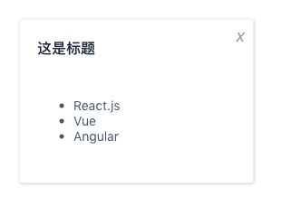

# React.js

[TOC]


## children

一个组件通过 <u>props</u> 除了能给获取自身属性上的值，还可以获取被组件包含的内容，也就是外部子组件，前面我们写的组件更多的是作为一个单标签组件，实际应用中很多组件是双标签的，也就是可以包含内容的，也可称为：<u>容器组件</u>，那么组件包含的内容，我们就可以通过 <u>props.children</u> 来获取

### dialog 组件



#### css

```jsx
.dialog {
    position: fixed;
    left: 50%;
    top: 30%;
    transform: translateX(-50%) translateY(-50%) ;
    border-radius: 2px;
    box-shadow: 0 1px 3px rgba(0,0,0,.3);
    box-sizing: border-box;
    background: #fff;
    width: 30%;
}
.dialog_header {
    padding: 20px 20px 0;
    text-align: left;
}
.dialog_title {
    font-size: 16px;
    font-weight: 700;
    color: #1f2d3d;
}
.dialog_content {
    padding: 30px 20px;
    color: #48576a;
    font-size: 14px;
    text-align: left;
}
.dialog_close_btn {
    position: absolute;
    right: 10px;
    top: 5px;
}
.dialog_close_btn:before {
    content: 'x';
    color: #999;
    font-size: 20px;
    cursor: pointer;
}
```

#### dialog.js

```jsx
import React from 'react';
import './dialog.css';

export default class Dialog extends React.Component {

    static defaultProps = {
        title: '这是默认标题'
    }

    render() {
        return(
            <div className="dialog">
                <i className="dialog_close_btn"></i>
                <div className="dialog_header">
                    <span className="dialog_title">{this.props.title}</span>
                </div>
                <div className="dialog_content">
                    {this.props.children}
                </div>
            </div>
        );
    }

}
```

