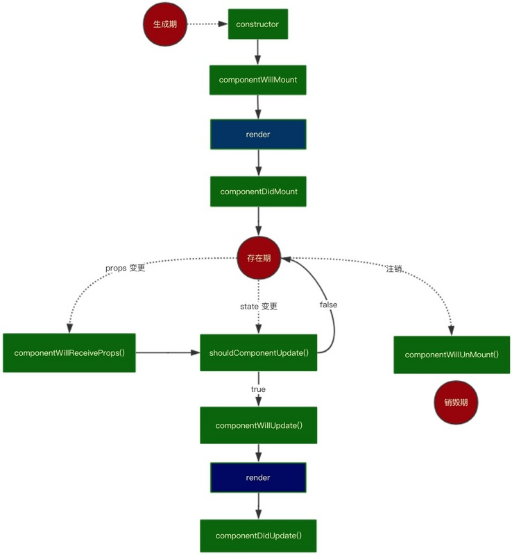

# React.js

[TOC]

## 生命周期

所谓的生命周期就是指某个事物从开始到结束的各个阶段，当然在 <u>React.js</u> 中指的是组件从创建到销毁的过程，<u>React.js</u> 在这个过程中的不同阶段调用的函数，通过这些函数，我们可以更加精确的对组件进行控制，前面我们一直在使用的 <u>render</u> 函数其实就是组件生命周期渲染阶段执行的函数

### 周期分类

<u>React.js</u> 为组件的生命周期划分了`四个`不同的阶段

- 挂载阶段
- 更新阶段
- 卸载阶段
- 错误处理

wd不同的阶段又会对应着一些不同的函数

参考：http://projects.wojtekmaj.pl/react-lifecycle-methods-diagram/



### 挂载阶段

挂载阶段是指组件创建到渲染到页面的过程，这个过程提供了`四个`不同的函数

- constructor()
- render()
- static getDerivedStateFromProps()
- componentDidMount()

#### constructor

```jsx
constructor(props)
```

类的构造函数，也是组件初始化函数，一般情况下，我们会在这个阶段做一些初始化的工作

- 初始化 <u>state</u>
- 处理事件绑定函数的 <u>this</u>

#### render()

<u>render</u> 方法是 <u>Class</u> 组件必须实现的方法

#### static getDerivedStateFromProps()

```jsx
static getDerivedStateFromProps(props, state)
```

该方法会在 <u>render</u> 方法之前调用，无论是挂载阶段还是更新阶段，它的存在只有一个目的：让组件在 <u>props</u> 变化时更新 <u>state</u>

案例：[邮件发送-收件人选择](./邮件发送-收件人选择.md)

#### componentDidMount()

```jsx
componentDidMount()
```

在组件挂载后（<u>render</u> 的内容插入 <u>DOM</u> 树中）调用。通常在这个阶段，我们可以：

- 操作 <u>DOM</u> 节点
- 发送请求

### 更新阶段

更新阶段是指组件重新渲染的过程，组件 <u>state</u> 的更新（调用 <u>setState()</u>）和父组件渲染都会触发

- static getDerivedStateFromProps()
- shouldComponentUpdate()
- render()
- getSnapshotBeforeUpdate()
- componentDidUpdate()

#### static getDerivedStateFromProps()

同挂载阶段，更新阶段也会触发该生命周期函数

#### shouldComponentUpdate()

```jsx
shouldComponentUpdate(nextProps, nextState)
```

发生在更新阶段，<u>getDerivedStateFromProps</u> 之后，<u>render</u> 之前，该函数会返回一个布尔值，决定了后续是否执行 <u>render</u>，首次渲染不会调用该函数

```jsx
import React from 'react';
import Child from './Child';

export default class ShouldComponentUpdateComponent extends React.Component {
  	constructor(...args) {
      	super(...args);
        this.state = {
            n: 1,
        }
    }
  
  	render() {
        return(
            <div>
            		<h2 onClick={e=> {
                    this.setState({n: this.state.n + 1})
                }}>n: {this.state.n}</h2>
                <Child value={this.state.n} />
	          </div>
        )
    }
}
```

```jsx
import React from 'react';

export default class Child extends React.Component {

    constructor(...props) {
        super(...props);

        this.state = {
            value: this.props.value
        };
    }
  
  	shouldComponentUpdate(nextProps, nextState) {
        return this.state.value !== nextState.value;
    }
  
  	render() {
        console.log('render');
        return(
            <div>
                value: {this.state.value}
                <button onClick={e=>{
                    this.setState({
                        value: this.state.value + 1
                    })
                }}>+</button>
            </div>
        );
    }
}
```

> 此方法仅作为性能优化的方式而存在，不要企图依靠此方法来“阻止”渲染，因为可能会产生一些问题。其次，在 <u>React.js</u> 中本来对渲染已经做了必要的优化了，所以通过该函数本质上不能带来特别大的明显提升，且容易增加组件的复杂性，变得难以维护，除非确定使用它能为当前组件带来显著的性能提升
>
> 官方后期也会更改该方法的特性，即使返回 <u>false</u> 仍可能会重新渲染组件
>
> 不推荐滥用该函数

#### render()

同上

#### getSnapshotBeforeUpdate()

```jsx
getSnapshotBeforeUpdate(prevProps, prevState)
```

该方法在 <u>render()</u> 之后，但是在输出到 <u>DOM</u> 之前执行，用来获取渲染之前的快照。当我们想在当前一次更新前获取上次的 <u>DOM</u> 状态，可以在这里进行处理，该函数的返回值将作为参数传递给下个生命周期函数 <u>componentDidUpdate</u>

> 该函数并不常用。

#### componentDidUpdate()

```jsx
componentDidUpdate(prevProps, prevState, snapshot)
```

该函数会在 <u>DOM</u> 更新后立即调用，首次渲染不会调用该方法。我们可以在这个函数中对渲染后的 <u>DOM</u> 进行操作

### 卸载阶段

当组件从 DOM 中移除时会调用如下方法

- componentWillUnmount()

#### componentWillUnmount()

```jsx
componentWillUnmount()
```

该方法会在组件卸载及销毁前调用，我们可以在这里做一些清理工作，如：组件内的定时器、未完成的请求等

### 错误处理

当渲染过程，子组件的构造函数或生命周期中抛出错误时，会调用如下方法

- static getDerivedStateFromError()
- componentDidCatch()

#### static getDerivedStateFromError()

```jsx
static getDerivedStateFromError(error)
```

该方法用来获取子组件抛出的错误，返回值是一个对象，该对象被存储在 <u>state</u> 中，在后续的 <u>render</u> 方法中就可以根据这个对象的值来进行处理，如：显示不同的 <u>UI</u>

```jsx
class ErrorBoundary extends React.Component {
      constructor(props) {
      super(props);
      this.state = { hasError: false };
  }

  static getDerivedStateFromError(error) {
      return { hasError: true };
  }

  render() {
      if (this.state.hasError) {
        	return <div>出错了</div>;
      }
      return this.props.children;
  }
}
```

#### componentDidCatch()

```jsx
componentDidCatch(error, info)
```

该方法与 <u>getDerivedStateFromError()</u> 类似，但是也有不同的地方：

- 该方法会有一个记录详细错误堆栈信息的 <u>info</u> 参数
- 该方法可以执行一些额外的操作：打印错误、上报错误信息……