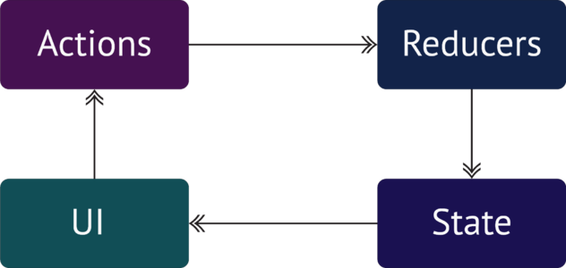

# Redux

[TOC]

## 知识点

- 状态管理器
- state 对象
- reducer 纯函数
-  store 对象
- action 对象
- combineReducers 方法
- react-redux
- provider 组件
- connect 方法
- Redux DevTools extension 工具
- 中间件 - middleware
- redux-chunk


## 状态（数据）管理

前端应用越来越复杂，要管理和维护的数据也越来越多，为了有效的管理和维护应用中的各种数据，我们必须有一种强大而有效的数据管理机制，也称为状态管理机制，<u>Redux</u> 就是解决该问题的


## Redux

<u>Redux</u> 是一个独立的 <u>JavaScript</u> 状态管理库，与非 <u>React</u> 内容之一

https://www.bootcdn.cn/redux/

### 核心概念

理解 <u>Redux</u> 核心几个概念与它们之间的关系

- state
- reducer
- store
- action

#### <u>state</u> 对象

通常我们会把应用中的数据存储到一个对象树（<u>Object Tree</u>） 中进行统一管理，我们把这个对象树称为：<u>state</u>

##### <u>state</u> 是只读的

这里需要注意的是，为了保证数据状态的可维护和测试，不推荐直接修改 <u>state</u> 中的原数据

##### 通过纯函数修改 <u>state</u>

什么是纯函数？

###### 纯函数

1. 相同的输入永远返回相同的输出
2. 不修改函数的输入值
3. 不依赖外部环境状态
4. 无任何副作用

使用纯函数的好处

1. 便于测试
2.  有利重构

#### Reducer 函数

```jsx
function todo(state, action) {
  switch(action.type) {
    case 'ADD':
      return [...state, action.payload];
      break;
    case 'REMOVE':
      return state.filter(v=>v!==action.payload);
      break;
    default:
      return state;
	}
}
```

上面的 <u>todo</u> 函数就是 <u>Reducer</u> 函数

1. 第一个参数是原 <u>state</u> 对象
2. <u>Reducer</u> 函数不能修改原 <u>state</u>，而应该返回一个新的 <u>state</u>
3. 第二参数是一个 <u>action</u> 对象，包含要执行的操作和数据
4. 如果没有操作匹配，则返回原 <u>state</u> 对象

#### action 对象

我们对 <u>state</u> 的修改是通过 <u>reducer</u> 纯函数来进行的，同时通过传入的 <u>action</u> 来执行具体的操作，<u>action</u> 是一个对象

- type 属性 : 表示要进行操作的动作类型，增删改查……
- payload属性 : 操作 <u>state</u> 的同时传入的数据

但是这里需要注意的是，我们不直接去调用 <u>Reducer</u> 函数，而是通过 <u>Store</u> 对象提供的 <u>dispatch</u> 方法来调用

#### Store 对象

为了对 <u>state</u>，<u>Reducer</u>，<u>action</u> 进行统一管理和维护，我们需要创建一个 <u>Store</u> 对象

##### Redux.createStore 方法

```jsx
let store = Redux.createStore((state, action) => {
  // ...
}, []);
```

**todo**

用户操作数据的 <u>reducer</u> 函数

**[]**

初始化的 <u>state</u>

我们也可以使用 <u>es6</u> 的函数参数默认值来对 <u>state</u> 进行初始化

```jsx
let store = Redux.createStore( (state = [], action) => {
  // ...
} )
```

##### getState() 方法

通过 <u>getState</u> 方法，可以获取 <u>Store</u> 中的 <u>state</u>

```jsx
store.getState();
```

##### dispatch() 方法

通过 <u>dispatch</u> 方法，可以提交更改

```jsx
store.dispatch({
  type: 'ADD',
  payload: 'MT'
})
```

##### <u>action</u> 创建函数

<u>action</u> 是一个对象，用来在 <u>dispatch</u> 的时候传递动作和数据，我们在实际业务中可能会中许多不同的地方进行同样的操作，这个时候，我们可以创建一个函数用来生成（返回）<u>action</u>

```jsx
function add(payload) {
  return {
    type: 'ADD',
    payload
  }
}

store.dispatch(add('MT'));
store.dispatch(add('Reci'));
...
```

##### subscribe() 方法

可以通过 <u>subscribe</u> 方法注册监听器（类似事件），每次 <u>dispatch</u> <u>action</u> 的时候都会执行监听函数，该方法返回一个函数，通过该函数可以取消当前监听器

```jsx
let unsubscribe = sotre.subscribe(function() {
  console.log(store.getState());
});
unsubscribe();
```

### Redux 工作流



### Reducers 分拆与融合

当一个应用比较复杂的时候，状态数据也会比较多，如果所有状态都是通过一个 <u>Reducer</u> 来进行修改的话，那么这个 <u>Reducer</u> 就会变得特别复杂。这个时候，我们就会对这个 <u>Reducer</u> 进行必要的拆分

```jsx
let datas = {
  user: {},
  items: []
  cart: []
}
```

我们把上面的 <u>users</u>、<u>items</u>、<u>cart</u> 进行分拆

```jsx
// user reducer
function user(state = {}, action) {
  // ...
}
// items reducer
function items(state = [], action) {
  // ...
}
// cart reducer
function cart(state = [], action) {
  // ...
}
```

#### <u>combineReducers</u> 方法

该方法的作用是可以把多个 <u>reducer</u> 函数合并成一个 <u>reducer</u> 

```jsx
let reducers = Redux.combineReducers({
  user,
  items,
  cart
});

let store = createStore(reducers);
```


## react-redux

再次强调的是，<u>redux</u> 与 <u>react</u> 并没有直接关系，它是一个独立的 <u>JavaScript</u> 状态管理库，如果我们希望中 <u>React</u> 中使用 <u>Redux</u>，需要先安装 <u>react-redux</u>

### <u>react-redux</u>

#### 安装

```bash
npm i -S redux react-redux
```

```jsx
// ./store/reducer/user.js
let user = {
    id: 0,
    username: ''
};

export default (state = user, action) => {
    switch (action.type) {
        default:
            return state;
    }
}
```

```jsx
// ./store/reducer/users.js
let users = [{
    id: 1,
    username: 'baoge',
    password: '123'
},
{
    id: 2,
    username: 'MT',
    password: '123'
},
{
    id: 3,
    username: 'dahai',
    password: '123'
},
{
    id: 4,
    username: 'zMouse',
    password: '123'
}];

export default (state = users, action) => {
    switch (action.type) {
        default:
            return state;
    }
}
```

```jsx
// ./store/reducer/items.js
let items = [
    {
        id: 1,
        name: 'iPhone XR',
        price: 542500
    },
    {
        id: 2,
        name: 'Apple iPad Air 3',
        price: 377700
    },
    {
        id: 3,
        name: 'Macbook Pro 15.4',
        price: 1949900
    },
    {
        id: 4,
        name: 'Apple iMac',
        price: 1629900
    },
    {
        id: 5,
        name: 'Apple Magic Mouse',
        price: 72900
    },
    {
        id: 6,
        name: 'Apple Watch Series 4',
        price: 599900
    }
];

export default (state = items, action) => {
    switch (action.type) {
        default:
            return state;
    }
}
```

```jsx
// ./store/reducer/cart.js
export default (state = [], action) => {
    switch (action.type) {
        default:
            return state;
    }
}
```

```jsx
// ./store/index.js
import {createStore, combineReducers} from 'redux';

import user from './reducer/user';
import users from './reducer/users';
import items from './reducer/items';
import cart from './reducer/cart';

let reducers = combineReducers({
    user,
    users,
    items,
    cart
});

const store = createStore(reducers);

export default store;
```

#### <u>Provider</u> 组件

想在 <u>React</u> 中使用 <u>Redux</u> ，还需要通过 <u>react-redux</u> 提供的 <u>Provider</u> 容器组件把 <u>store</u> 注入到应用中

```jsx
// index.js
import {Provider} from 'react-redux';
import store from './store';

ReactDOM.render(
    <Provider store={store}>
        <Router>
            <App />
        </Router>
    </Provider>, 
    document.getElementById('root')
);
```

#### <u>connect</u> 方法

有了 <u>connect</u> 方法，我们不需要通过 <u>props</u> 一层层的进行传递， 类似路由中的 <u>withRouter</u> ，我们只需要在用到 <u> store</u> 的组件中，通过 <u>react-redux</u> 提供的 <u>connect</u> 方法，把 <u>store</u> 注入到组件的 <u>props</u> 中就可以使用了

```jsx
import {connect} from 'react-redux';

class Main extends React.Component {
  render() {
    console.log(this.props);
  }
}

export default connect()(Main);
```

默认情况下，<u>connect</u> 会自动注入 <u>dispatch</u> 方法

##### 注入 <u>state</u> 到 <u>props</u>

```jsx
export default connect( state => {
  return {
    items: state.items
  }
} )(Main);
```

<u>connect</u> 方法的第一个参数是一个函数

- 该函数的第一个参数就是 <u>store</u> 中的 <u>state</u> : `store.getState()`
- 该函数的返回值将被解构赋值给 <u>props</u> : `this.props.items`


## Redux DevTools extension

为了能够更加方便的对 <u>redux</u> 数据进行观测和管理，我们可以使用 <u>Redux DevTools extension</u> 这个浏览器扩展插件

https://github.com/zalmoxisus/redux-devtools-extension

```jsx
const store = createStore(
    reducers,
    window.__REDUX_DEVTOOLS_EXTENSION__ && window.__REDUX_DEVTOOLS_EXTENSION__()
);
```

打开浏览器开发者工具面板 -> redux


## 异步 action

许多时候，我们的数据是需要和后端进行通信的，而且中开发模式下，很容易就会出现跨域请求的问题，好在 <u>create-react-app</u> 中内置了一个基于 <u>node</u> 的后端代理服务，我们只需要少量的配置就可以实现跨域

### package.json 配置

相对比较的简单的后端 <u>URL</u> 接口，我们可以直接中 <u>package.json</u> 文件中进行配置

```
// 后端接口
http://localhost:7777/api/items
```

```json
// http://localhost:3000
{
  ...
  //
  "proxy": "http://localhost:7777"
}
```

```jsx
axios({
  url: '/api/items'
});
```

### ./src/setupProxy.js 配置

针对相对复杂的情况，可以有更多的配置

```bash
npm i -S http-proxy-middleware
```

```jsx
// setupProxy.js
const proxy = require('http-proxy-middleware');

module.exports = function(app) {
    app.use(
        proxy('/api', {
            target: 'http://localhost:7777/',
            pathRewrite: {
                '^/api': ''
            }
        })
    );
};
```

其它代码同上


## Middleware

默认情况下，<u>dispatch</u> 是同步的，我们需要用到一些中间件来处理

```jsx
const logger = store => next => action => {
  console.group(action.type)
  console.info('dispatching', action)
  let result = next(action)
  console.log('next state', store.getState())
  console.groupEnd(action.type)
  return result
}
```

### redux.applyMiddleware

通过 <u>applyMiddleware</u> 方法，我们可以给 <u>store</u> 注册多个中间件

> 注意：<u>devTools</u> 的使用需要修改一下配置

```bash
npm i -D redux-devtools-extension
```

```jsx
...
import { composeWithDevTools } from 'redux-devtools-extension';
...
const store = createStore( 
  reducres, 
  composeWithDevTools(
    applyMiddleware( logger )
  )
)
```

## redux-thunk

这是一个把同步 <u>dispatch</u> 变成异步 <u>dispatch</u> 的中间件

### 安装

```bash
npm i -S redux-thunk
```

```jsx
import {createStore, combineReducers, applyMiddleware} from 'redux';
import thunk from 'redux-thunk';
import { composeWithDevTools } from 'redux-devtools-extension';

import user from './reducer/user';
import items from './reducer/items';
import cart from './reducer/cart';

let reducers = combineReducers({
    user,
    items,
    cart
});

const store = createStore(
    reducers,
    composeWithDevTools(applyMiddleware(
        thunk
    ))
);
```