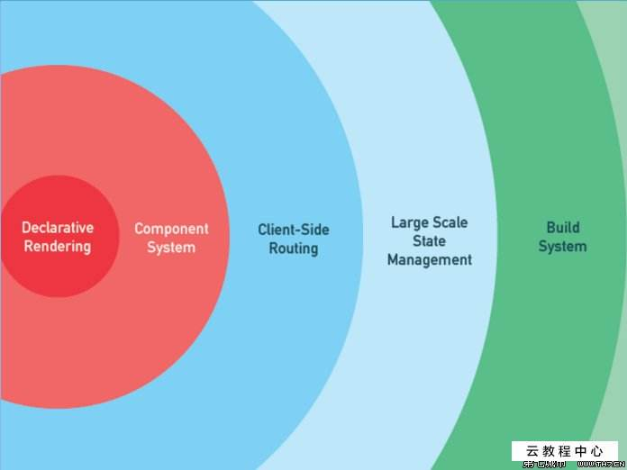

# Vue.js

[TOC]

## vue.js


`vue.js` 是一套用于构建用户界面的渐进式框架

### 渐进式



### Vue 核心

- 声明式渲染
- 组件


## 引入

我们还是先通过 \<script\> 的方式来引入 <u>vue</u>

```html
<script src="https://cdn.jsdelivr.net/npm/vue/dist/vue.js"></script>
```


## 组件

`vue` 的核心功能之一就是组件


### 组件基本分类

- 根组件
- 可复用的功能组件

### 根组件的创建

通过 `vue` 提供的构造函数可以实例化出来一个跟组件实例对象

```js
let app = new Vue(创建组件所需要的一些配置选项);
```

### 可复用的功能组件

通过 `Vue` 提供的静态方法 `component` 窗口可复用的功能组件

```js
let component1 = Vue.component(创建组件所需要的一些配置选项)
```

> 组件配置选项：https://cn.vuejs.org/v2/api/


## 组件内容渲染

渲染一个组件的内容可以通过两种方式来进行

- template 选项
- render 选项（函数）

### template

type : string

组件的模板结构（HTML），模板内容会被 `vue` 进行渲染，生成最终的 `HTML` 内容，并替换占位（挂载）元素

### el

type : string | Element

提供一个在页面上已存在的 DOM 元素作为 Vue 实例的挂载目标。可以是 CSS 选择器，也可以是一个 HTMLElement 实例，

- 该选择只对 `new` 创建的实例有效
- 如果提供 `el` ，但是没有提供 `template` ，则 `el` 的内容讲作为 `template`

### render

type : (createElement: () => VNode) => VNode

发挥 `JavaScript` 最大的编程能力，直接创建 `VNode` （虚拟dom对象），优先级高于 `el` 和 `template`

- 有更强大的编程能力
- 有更高的性能

> https://cn.vuejs.org/v2/guide/render-function.html

### 使用 $mount 方法延迟 `Vue` 实例的挂载

当 `Vue` 实例没有 `el` 选项的时候，它会处于一种 <u>未挂载</u> 的状态，我们可以通过组件 `Vue` 实例对象的 `$mount` 方法来手动挂载，通过该方式，我们也可以达到延迟 `Vue` 实例的挂载的目的


## 组件中的数据（状态）

### data

组件内部使用的数据，`data` 是一个对象，`data` 中的值可以中模板中直接访问

- `Vue` 实例组件（根组件）的 `data` 是一个对象
- 可复用功能组件的 `data` 必须是一个函数，且该函数必须返回一个对象（因为复用性，避免多个组件实例引用同一个对象。换句话说，组件中使用的数据必须是一个对象，但是可复用组件的这个数据对象必须通过函数返回

### data 的访问

`data` 数据可以直接通过组件实例对象访问，也可以通过实例对象下的 `$data` 属性进行访问

> 组件实例对象下有很多的以 `$` 开头的属性，这些都是实例对象内置的一些属性和方法，`vue` 为了区分数据与内置属性方法，内置的属性和方法默认都是以 `$` 开始的，所以我们中数据中应该避免使用 `$` 开头的数据

## 模板语法

<u>vue</u> 使用了基于 <u>html</u> 的模板语法，使用声明式的方式把实例中的数据（`data`）与 <u>DOM</u> 进行绑定，`data` 中的数据在模板中可以直接使用

### Mustache（双大括号，大胡子） 语法

在 <u>vue</u> 中，我们是通过一对双大括号把实例中的数据渲染到模板内容中

###### 插值表达式

在 {{}} 中，我们可以放置表达式值

```js
{{表达式}}
```

```js
new Vue({
  el: '#app',
  data: {
    title: 'vue 框架'
  },
  template: `<div>{{title}}</div>`
});
```

```html
<!DOCTYPE html>
<html lang="en">
<head>
    <meta charset="UTF-8">
    <meta name="viewport" content="width=device-width, initial-scale=1.0">
    <meta http-equiv="X-UA-Compatible" content="ie=edge">
    <title>Document</title>
</head>
<body>

    <div id="app">
      {{title}}
  	</div>
    
    <script src="https://cdn.jsdelivr.net/npm/vue/dist/vue.js"></script>

    <script>
        let app = new Vue({
            el: '#app',
            data: {
              title: 'vue 框架'
            }
        });
    </script>
</body>
</html>
```

### 数据到视图的更新

<u>vue</u> 会把  `data` 中的数据挂载到实例属性下，同时对它们进行主动的监听拦截，当数据发生变化的时候，重新渲染模板。我们可以通过实例对象对数据进行修改

```js
app.title = '开课吧';
// or
app.$data.title = '开课吧';
```

### 检测变化的注意事项

在 <u>vue3</u> 之前，数据的监听是通过 `Object.defineProperty` 方法来实现的，但是该方法只能监听拦截单个数据，对于对象新增属性无法监听拦截。所以，对于数据对象中新增的属性，我们需要调用 <u>vue</u> 提供的方法来进行处理

### 扩展

通过 `Object.defineProperty` 监听拦截中存在一些问题

- 对象新增属性
- 数组方法：push、pop、shift、unshift、splice、sort、reverse
- 数组新增值：[]
- 数组 length 属性

以上的操作中并不会触发监听拦截

> `vue` 对数组中的 `push`、`pop` 等方法进行重新包装，所以在 `vue` 中调用这些方法，可以对数组的修改进行监听拦截
>
> [https://cn.vuejs.org/v2/guide/list.html#%E5%8F%98%E5%BC%82%E6%96%B9%E6%B3%95-mutation-method](https://cn.vuejs.org/v2/guide/list.html#变异方法-mutation-method)

### 使用 Vue.set 方法添加新数据

```html
<!DOCTYPE html>
<html lang="en">
<head>
    <meta charset="UTF-8">
    <meta name="viewport" content="width=device-width, initial-scale=1.0">
    <meta http-equiv="X-UA-Compatible" content="ie=edge">
    <title>Document</title>
</head>
<body>

    <div id="app">
        <p>title: {{title}}</p>
        <p>user.username: {{user.username}}</p>
        <p>user.gender: {{user.gender}}</p>
    </div>
    
    <script src="https://cdn.jsdelivr.net/npm/vue/dist/vue.js"></script>

    <script>
        let app = new Vue({
            el: '#app',
            data: {
                title: 'vue 框架',
                user: {
                    username: 'zMouse'
                }
            }
        });
    </script>
</body>
</html>
```

在模板中，我们使用了一个不存在的数据 `user.gender`

如果我们通过 `app.user.gender = '男' `的方式来新增，是不会被 <u>vue</u> 拦截监听处理的，我们需要使用

```js
Vue.set(app.user, 'gender', '男');
// 实例.$set 是 Vue.set 的别名
app.$set(app.user, 'gender', '男');
```

这样的方式，`set` 方法给 `app.user`  添加 `gender` 属性的同时，对它进行了 `defineProperty`

