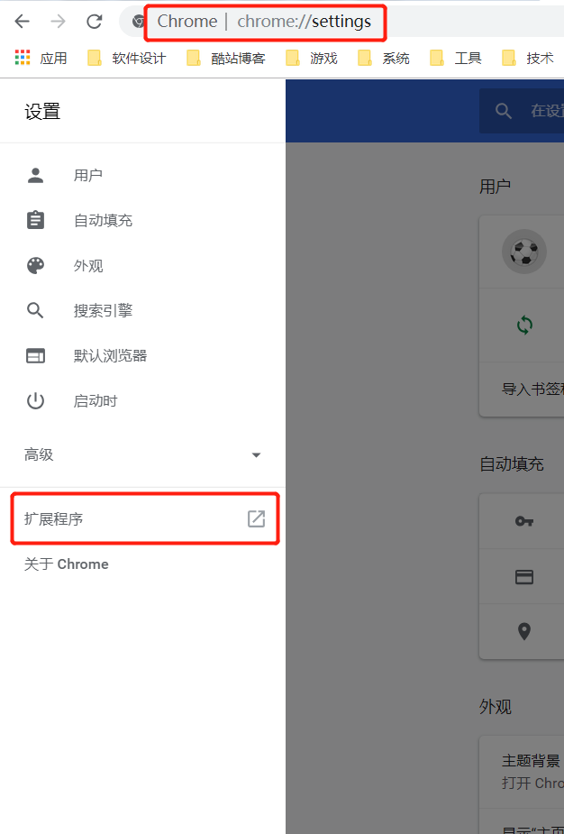
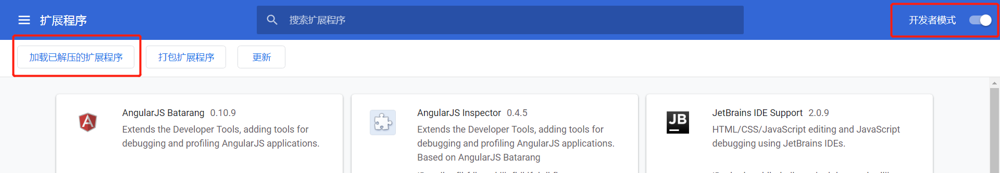
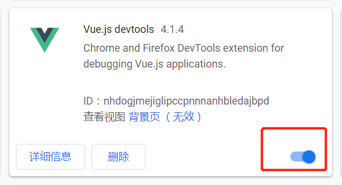

# vue-devTools

[TOC]

## vue-devTools

为了更方便的在开发过程中对 Vue 程序进行调试，除了传统的浏览器自带的 debug 工具以外，我们还可以通过一些专门为 Vue 提供的扩展插件来进行调试

参考：https://github.com/vuejs/vue-devtools

Vue.js-devtools，[点击下载](./assets/Vue.js-devtools_v3.1.6.crx)

##### 安装步骤

1、首先进入浏览器设置，点击 `扩展程序`

2、开启 `开发者模式`，点击 `加载已解压的扩展程序` 或者 直接拖拽已解压的扩展程序

​	注：已解压的扩展程序就是上面下载的 Vue.js-devtools_v3.1.6.crx

3、安装成功以后就可以看到：

点击红框处开启

4、通过 `npm run serve` 启动应用以后，即可看到浏览器右上角的 Vue 插件图片，图 `红框一` 处，表示 `Vue.js devtools` 已启动，点击图 `红框二` 的 vue 一项

