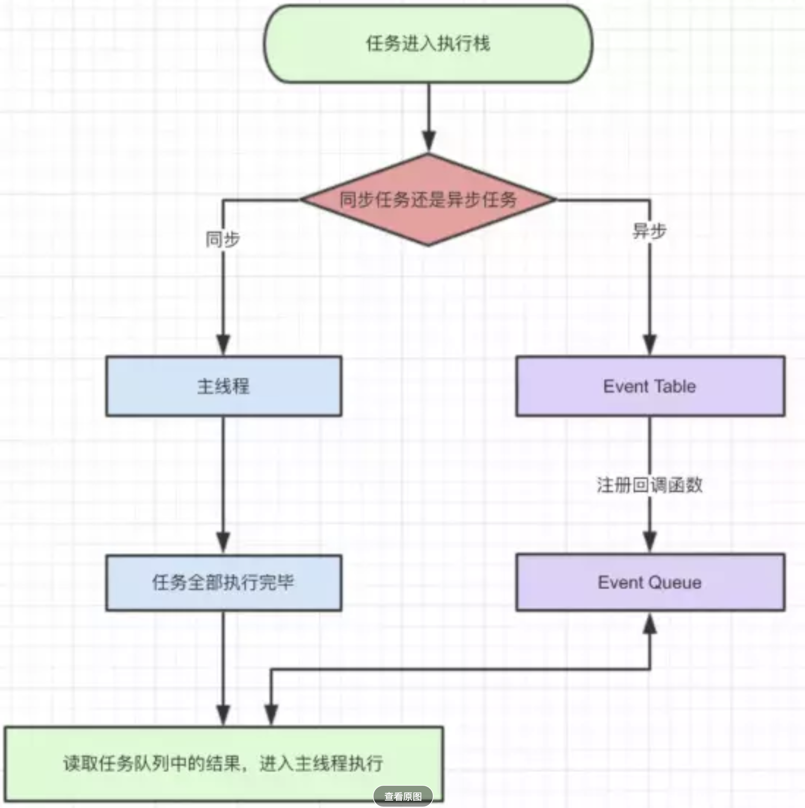

# Promise原理解析与实现

[TOC]

## 介绍

`Promise` 是 `JavaScript` 异步编程的一种流行解决方案，掌握 `Promise` 的使用是我们不可或缺的一项基本技能。但是要想熟练掌握并深入的理解它，还是必须要知道它的实现原理的。这节课就是从具体使用角度出发，使用原生手写方式一步一步的带你实现 `Promise` 库，而且不仅仅只是包含了 `Promise` 目前通用的功能，还有 `Promise` 的一些新的特性和未来即将支持的特性的介绍与实现

## 知识要点

- Promise 类
- Promise 状态
- promise.#resolve 方法
- promise.#reject 方法
- promise.then 方法
- promise.catch 方法
- promise.finally 方法 （<u>ECMA2018 Added</u>）
- Promise.resolve 方法
- Promise.reject 方法
- Promise.all 方法
- Promise.race 方法
- Promise.allSettled 方法 （TC39第4阶段草案 - ECMA 2020 新增）

## 学习目标

- 了解 `Promise` 基本实现原理
- 深入掌握 `Promise` 的使用细节
- 了解 `Promise` 未来新标准新特性

## 学前须知

本次 `Promise` 源码课程中会涉及到面向对象的使用，所以如果您能知道一些面向对象的知识（基础即可），会更加有利于您的理解

## Promise 类

`Promise` 的构造函数必须接收一个函数参数（也就是需要执行异步任务的函数），该函数将在传入以后立即调用，并传入 `Promise` 对象下的两个方法 `resolve` 和 `reject` 

## Promise 状态

每一个 `Promise` 对象都存在以下三种状态：

- PENDING : 进行中，`Promise` 对象的初始状态
- FULFILLED : 已成功
- REJECTED : 已失败

> 每一个 `Promise` 对象只能由 `PENDING` 状态变成 `FULFILLED` 或 `REJECTED`，且状态发生变化以后就能再改变了 ---- 记住这个特性

一个 `Promise` 对象状态的变化并不由 `Promise` 对象本身来决定，而应该是由我们传入的异步任务完成情况来决定的，`Promise` 提供了两个用来改变状态的方法

## promise.#resolve 方法

将 `Promise` 对象的状态从 `PENDING` 变为 `FULFILLED`，并执行成功后的注册任务

> 注意：如果当前状态已经改变过了，则直接 `return`

## promise.#reject 方法

将 `Promise` 对象的状态从 `PENDING` 变为 `REJECTED`，并执行失败后的注册任务

> 注意：如果当前状态已经改变过了，则直接 `return`

## promise.then 方法

`then` 是 `Promise` 对象提供的一个方法，它接收两个函数作为参数，分别注册到 `resolve` 和 `reject`  方法执行后的任务队列中，我们需要在 `Promise` 中维护两个队列

- fulfilledQueues
- rejectedQueues

### 添加任务

把 `then` 方法中接收到的两个函数分别添加到对应的任务队列中

### 执行任务

在 `Promise.resolve` 和 `Promise.reject` 方法中调用执行对应的任务队列的所有注册函数

### 宏任务 & 微任务

- 异步任务
  - 微任务
  - 宏任务

`then` 方法是一个微任务

- setTimeout(fn, 0);
- postMessage
- MutationObserver

### 结果传递

在调用 `reslove` 或者 `reject` 方法的时候，我们还可以通过传入一些值，在后续的 `then` 方法中，可以通过对应的函数接收到该结果

> 如果在一个 `Promise` 对象的状态改变后调用`then` 则会立即执行添加的对应函数，所以需要注意必须根据当前 `Promise` 的状态来做不同的处理
>
> - PENDING : 添加到对应的任务队列
> - FULFILLED / REJECTED : 不用添加到队列，而是立即执行任务

### 返回值

`then` 方法在执行最后必须返回一个新的 `Promise` 对象

> 重点（难点）
>
> 返回 `Promise`对象会立即调用并执行，如果这个时候，直接去执行该对象的 `resolve` 或者 `reject` 方法都会导致后续的 `then` 也立即被调用
>
> 我们需要对原 `fulfilledHandler` 和 `rejectedHandler` 进行包装，把它们和新 `Promise` 对象的 `resolve` 和 `reject` 方法分别放置到新的函数中，并把这个新的函数添加到原有任务队列中调用
>
> 简而言之：把新返回的 `Promise` 对象的 `resolve` 和 `reject` 与 `then` 中执行的 `fulfilledHandler` 和 `rejectedHandler` 添加到一个任务队列中执行，这样才能使用原有的 `then` 执行完成以后才执行新的 `Promise` 中的 `then`

上面是默认情况下的处理情况，其实 `then` 方法的处理更为复杂

> 当一个[`Promise`](https://developer.mozilla.org/zh-CN/docs/Web/JavaScript/Reference/Global_Objects/Promise)完成（fulfilled）或者失败（rejected），返回函数将被异步调用（由当前的线程循环来调度完成）。具体的返回值依据以下规则返回：
>
> - 如果then中的回调函数没有返回值，那么then返回的Promise将会成为接受状态，并且该接受状态的回调函数的参数值为 undefined。
> - 如果then中的回调函数返回一个值，那么then返回的Promise将会成为接受状态，并且将返回的值作为接受状态的回调函数的参数值。
> - 如果then中的回调函数抛出一个错误，那么then返回的Promise将会成为拒绝状态，并且将抛出的错误作为拒绝状态的回调函数的参数值。
> - 如果then中的回调函数返回一个已经是接受状态的Promise，那么then返回的Promise也会成为接受状态，并且将那个Promise的接受状态的回调函数的参数值作为该被返回的Promise的接受状态回调函数的参数值。
> - 如果then中的回调函数返回一个已经是拒绝状态的Promise，那么then返回的Promise也会成为拒绝状态，并且将那个Promise的拒绝状态的回调函数的参数值作为该被返回的Promise的拒绝状态回调函数的参数值。
> - 如果then中的回调函数返回一个未定状态（pending）的Promise，那么then返回Promise的状态也是未定的，并且它的终态与那个Promise的终态相同；同时，它变为终态时调用的回调函数参数与那个Promise变为终态时的回调函数的参数是相同的。

## promise.catch 方法

## promise.finally 方法

<u>ECMA2018 Added</u>

## Promise.resolve 方法

## Promise.reject 方法

## Promise.all 方法

## Promise.race 方法

## Promise.allSettled 方法

[（TC39第4阶段草案）](https://tc39.es/proposal-promise-allSettled/)

ECMA 2020 新增